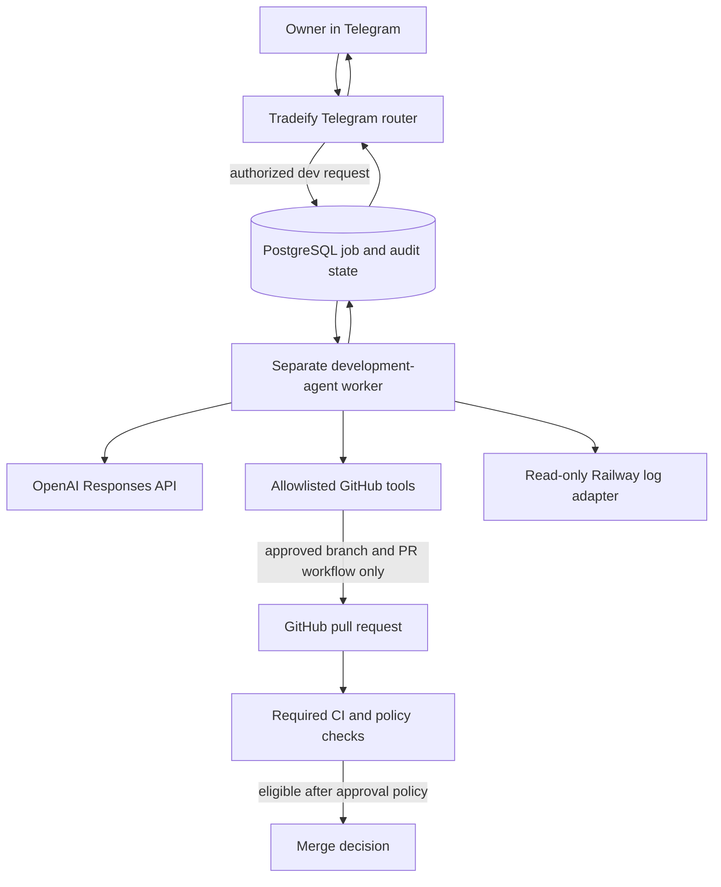

# Post-Automation Addendum A - Owner-Only OpenAI Development Agent

## Status and scheduling

This addendum was accepted as future project scope on 2026-08-13 after review of the 73-page proposal titled *OpenAI Responses API Coding Agent for @BagMonsterTradeifyBot*.

It is **not implemented** and does not change the current Stage A bot.

Work on this addendum may begin only after:

1. the current Tradeify build, validation, and automation roadmap is complete;
2. live trading automation has been deliberately approved and shown to be stable;
3. D-007's final Telegram command reference, synchronized `/help`, README link, and command/button tests are complete;
4. a fresh Codex Security review is completed for the then-current repository and proposed development-agent architecture;
5. all actionable high-severity findings are corrected and rechecked;
6. the owner approves the final architecture, credentials, repository permissions, deployment topology, data-retention choices, and merge policy in a new decision checkpoint; and
7. a staging and rollback plan exists so development-agent changes cannot silently compromise the live trading worker.

Until those gates pass, this document is a governed roadmap item only. It authorizes no OpenAI API key, GitHub write token, Railway token, new Telegram command, production code change, or automatic merge.

## 1. Purpose

Add an owner-only development assistant to the Telegram experience so the owner can ask natural-language questions such as:

- Why did the worker report an error?
- Which code path calculates position size?
- What changed in the latest pull request?
- Correlate these Railway errors with the current source.
- Prepare a safe proposal to fix this problem.

The assistant should be able to inspect current evidence, explain what it found, propose a bounded change, and - only through a separately approved workflow - create an isolated branch and pull request.

The goal is deeper, more focused development work from Telegram without treating the language model as an unrestricted production administrator.

## 2. Governing precedence

This addendum is subordinate to:

1. the latest Authoritative Project State;
2. approved entries in `docs/implementation-decision-log.md`;
3. the live GitHub repository for code truth;
4. the final implemented risk, execution, authorization, and command-reference requirements; and
5. the then-current official OpenAI, GitHub, Railway, Telegram, PostgreSQL, and Tradeify documentation.

D-001 through D-007 remain binding. In particular:

- Binance and DXtrade keep their approved source roles.
- All trading paths must use the shared risk and execution controls.
- D-004 still blocks DXtrade work until its security checkpoint passes.
- D-007 must be complete before this addendum starts.
- Both automatic-execution locks remain false throughout Stage A.

If this document conflicts with a later approved decision, the later decision controls.

## 3. Review outcome

### Accepted direction

The following proposal concepts are accepted for future design:

- GitHub is the source of truth for current code.
- Railway access is diagnostic and read-only.
- The owner can converse naturally after deliberately entering development mode.
- Repository inspection and log analysis do not need per-read approval.
- Code writes require a stored, proposal-specific approval.
- Read mode and write mode expose different tool sets.
- AI changes occur only on isolated branches and through pull requests.
- Required checks must pass before a merge can be considered.
- PostgreSQL stores workflow state, approvals, concurrency locks, and audit records.
- Repository contents, logs, issues, pull requests, comments, and MCP output are untrusted data, not privileged instructions.
- Repositories and tools are allowlisted.
- Credentials are used only by backend integrations and never inserted into prompts or Telegram messages.
- The feature is built in phases, beginning with a read-only assistant.

### Required modifications

The source proposal is accepted with these changes:

1. **Do not place the full agent runtime inside the live trading process.** Prefer a separate companion worker and a PostgreSQL-backed job boundary. The trading worker remains the sole Telegram polling process and routes only authorized development messages. The companion performs model/tool work without receiving trade execution credentials.
2. **Preserve existing command meanings.** `/status` remains the trading and risk status command. Development shortcuts use names such as `/devstatus`, `/devlogs`, `/devchanges`, and `/devreset`.
3. **Natural language is handled as development work only inside an explicit `/code` session.** Ordinary Telegram messages outside that mode must not become coding-agent instructions.
4. **Do not assume one approval is sufficient for protected changes.** Trade execution, order routing, risk logic, account rules, authentication, secrets, database migrations, deployment configuration, and security boundaries require a stronger workflow described below.
5. **Do not provide shell access to the Railway production runtime.** If OpenAI shell or apply-patch capabilities are used, they operate only in an isolated, disposable workspace containing an approved repository checkout.
6. **Do not pin conceptual examples to stale model names, SDK shapes, endpoints, or MCP tool names.** Revalidate all of them against official documentation and the installed SDK at implementation time.
7. **Do not duplicate owner identity without a reason.** Initially, the existing immutable numeric Telegram allowlist is the canonical identity. A later multi-user design may add explicit roles, but duplicate environment variables must be cross-validated to prevent drift.
8. **Do not let an agent merge merely because CI is green.** Branch protection, scope validation, proposal binding, staging evidence, and risk-specific approval must also pass.
9. **Do not make automatic production merging part of the initial rollout.** It is a later capability that requires measured reliability and a separate approval.

## 4. Current repository facts to re-audit later

As of this addendum's approval:

- Runtime: Node.js 22, ECMAScript modules, JavaScript.
- Telegram library: `node-telegram-bot-api` using long polling.
- Start command: `npm start` -> `node index.mjs`.
- Current validation scripts: `npm test` and `npm run check`.
- Database: PostgreSQL through `pg`.
- Deployment: Railway worker sourced from `BagMonster/tradeify-crypto-bot` on `main`.
- Current Telegram authorization: one immutable numeric user ID.
- Current automated coverage: 13 risk-engine tests plus JavaScript syntax checks.
- Current mode: Stage A simulation, with no DXtrade client or order-placement path.

These facts are snapshots, not permanent assumptions. Phase 1 must inspect the live repository, workflows, branch rules, Railway topology, and installed dependency versions again.

## 5. Preferred isolation architecture



The trading worker remains responsible for Telegram polling, trading controls, and operator responses. The development worker is a separate failure domain and must not receive DXtrade credentials, session tokens, order-routing functions, or direct database mutation tools for trading state.

PostgreSQL may be shared only through separate tables, narrowly scoped queries, and database roles where practical. The development worker must not have arbitrary write access to trading, ledger, or risk-control tables.

## 6. Authorization and operating modes

Every development command, callback, proposal approval, cancellation, and merge confirmation must independently verify the immutable numeric Telegram owner ID.

Never authorize with:

- username;
- display name;
- chat title;
- message contents; or
- a previous authorization result cached in process memory.

### Mode A - Analysis

Available only during an owner-started development session:

- search and read allowlisted repositories;
- inspect branches, commits, pull requests, and CI results;
- read controlled Railway build/runtime logs;
- search approved static project knowledge;
- maintain development conversation context;
- explain evidence and prepare proposals.

No branch, file, commit, pull request, merge, deployment, Railway configuration, trading-state, or secret mutation tool is exposed.

### Mode B - Approved branch execution

Activated only for one stored proposal after an owner approval passes all application checks.

The execution context receives:

- one allowlisted repository;
- one base branch;
- one change-request ID;
- the approved scope and risk classification;
- a deterministic branch name;
- only the narrow GitHub write tools needed for that workflow; and
- no production Railway mutation or trading execution tools.

Tool access expires when the request completes, fails, is cancelled, or materially changes scope.

## 7. Telegram experience

Natural language is primary after entering development mode with `/code`.

Provisional shortcuts are:

| Command | Purpose |
|---|---|
| `/code` | Enter or resume the owner-only development session. |
| `/devlogs` | Inspect controlled Railway build/runtime logs. |
| `/devchanges` | Show the pending proposal, active AI branch/PR, and recent agent changes. |
| `/devstatus` | Show development-agent connectivity and workflow state without exposing credentials. |
| `/devreset` | Start a new conversation while preserving audit history. |

These names are provisional until implementation and D-007 synchronization. Existing trading commands and buttons retain their current meanings.

Recommended buttons include:

- Show Evidence
- Explain Simply
- Technical Detail
- Show Proposed Changes
- Show Diff
- Approve Branch Work
- Confirm Protected Merge
- Cancel

Telegram must summarize large diffs and logs rather than flooding the chat. Full evidence should be paginated, bounded, and secret-redacted.

## 8. Evidence sources and authority

| Information | Authoritative source |
|---|---|
| Current application code | Live GitHub repository and exact commit/branch inspected |
| Runtime/build behavior | Controlled Railway logs and deployment metadata |
| Approved project rules | Decision log, final documentation, and approved static knowledge |
| Development conversation state | Responses/Conversations state plus PostgreSQL metadata, subject to approved retention policy |

Before making factual claims about current code, the agent must inspect the live repository and read related callers, dependencies, tests, configuration, and side effects. It must label observations, hypotheses, proposals, and unresolved questions separately.

## 9. Change workflow

The required state progression is:

```text
READ
  -> DIAGNOSE
  -> PROPOSE
  -> CLASSIFY RISK
  -> OWNER AUTHORIZES BOUNDED SCOPE
  -> CREATE ISOLATED BRANCH
  -> MODIFY APPROVED SCOPE
  -> RUN LOCAL/REPOSITORY VALIDATION
  -> OPEN PULL REQUEST
  -> VERIFY REQUIRED CHECKS AND POLICY
  -> MERGE DECISION
  -> AUDIT AND REPORT
```

Approval must reference a unique stored change-request ID and an immutable proposal hash. It is not general permission to modify the repository.

If implementation needs materially different files, behavior, permissions, dependencies, schema, or risk, the workflow stops and returns to proposal review. The old approval becomes invalid.

Only one write workflow per repository/base branch may run initially.

## 10. Risk classification and merge policy

### Normal changes

Examples may include documentation, tests, non-sensitive refactors, and observability changes that cannot affect trading decisions or execution.

After the read-only and proposal phases have passed formal evaluations, a separately approved policy may allow one proposal-bound owner approval to cover branch creation, implementation, PR creation, validation, and merge. Every required check and branch rule must still pass.

### Protected changes

Treat a change as protected if it affects or could indirectly affect:

- trade signals, entries, exits, stops, targets, or position monitoring;
- order creation, modification, cancellation, routing, reconciliation, or idempotency;
- position sizing, risk gates, account floors, payout rules, daily controls, or sequential-trade rules;
- Binance/DXtrade source roles, basis validation, market-data freshness, or time alignment;
- credentials, authentication, authorization, encryption, secrets, or sessions;
- PostgreSQL schemas, migrations, destructive queries, or production trading state;
- Telegram owner authorization, pause/resume, kill, flat, or other safety controls;
- Railway/GitHub/OpenAI configuration or deployment behavior; or
- dependencies with security or production-runtime impact.

For protected changes:

1. the first owner confirmation authorizes only branch implementation and a pull request;
2. the agent must show the final diff, tests, required checks, security results, and staging/canary evidence;
3. a second, explicit `Confirm Protected Merge` action is required at merge time; and
4. automatic merging is forbidden unless a later decision replaces this rule after demonstrated reliability.

The model may never bypass branch protection, failed checks, security findings, staging requirements, or Tradeify safety gates.

## 11. Validation and deployment

Validation commands must be discovered from the live repository rather than assumed. Inspect at least:

- `package.json` and the active lockfile;
- `.github/workflows/*`;
- Docker/Railway configuration if present;
- test, lint, type-check, build, migration, and security scripts; and
- GitHub branch protection and required checks.

Initial rollout must create pull requests without automatic merge. Merge automation for normal changes is a later, separately approved phase.

Because `main` may deploy automatically to Railway, a green pull request is not by itself proof that a change is safe for production. The final architecture must provide a staging validation path and a documented rollback method.

The development agent receives no Railway redeploy, restart, rollback, variable, domain, service, or project-configuration tools. Production deployment remains governed by GitHub and Railway configuration outside the agent.

## 12. OpenAI implementation requirements

The Responses API is an appropriate foundation because it supports stateful responses, tools, remote MCP integrations, and durable Conversations objects. File search with vector stores may later hold static project knowledge.

Implementation must nevertheless verify the then-current:

- OpenAI model and reasoning configuration;
- official SDK request/response schema;
- Responses and Conversations retention behavior;
- remote MCP server URL, tool list, approval behavior, and authorization requirements;
- tool compatibility and limits;
- pricing, rate limits, latency, and failure behavior; and
- availability of shell, apply-patch, file-search, and other tools under the selected model.

If apply-patch is used, the application still owns the harness that applies and reports patch results. If shell is used, it runs only in an isolated disposable workspace. Neither capability receives production runtime access.

Use `allowed_tools` or an equivalent current mechanism to minimize imported tools. Read and write toolsets must remain separate.

## 13. Memory, data handling, and retention

Persistent development conversations may use an OpenAI Conversation ID plus PostgreSQL metadata, but the final retention design requires explicit owner approval.

Before enabling persistence, document:

- what prompts, code, logs, tool calls, and outputs leave Railway;
- OpenAI and third-party MCP retention behavior;
- deletion/reset behavior;
- secret and personal-data redaction;
- maximum log and diff size;
- whether vector-store documents are static copies or synchronized artifacts; and
- how stale project knowledge is detected.

Current source remains in GitHub. Runtime evidence remains in Railway. A vector store may contain only approved static or slowly changing documents and must never silently override current code or approved decisions.

## 14. Credentials and least privilege

Potential future secrets include OpenAI, GitHub, and project-scoped Railway credentials. Exact variable names are chosen only during implementation.

The model must never receive or reveal:

- Telegram bot token;
- OpenAI API key;
- GitHub token;
- Railway token;
- PostgreSQL password or raw connection URL;
- DXtrade credentials, sessions, or tokens; or
- any secret returned in logs or configuration.

Required controls include:

- repository allowlists;
- project/environment-scoped Railway read access where available;
- separate read and write GitHub credentials or equivalent scoped installations;
- no organization-wide repository permission;
- protected `main` branch;
- credential rotation and revocation procedures;
- log redaction before model input and Telegram output;
- no arbitrary GraphQL, shell, SQL, URL-fetch, or repository selection tool; and
- auditable records of tool name, arguments after redaction, result, actor, scope, and timestamp.

## 15. Prompt-injection boundary

Text found in source files, logs, commits, issues, pull requests, comments, tool descriptions, MCP output, or user-generated application data is untrusted content.

It cannot:

- override system or application policies;
- grant permission;
- expand repository or tool scope;
- approve a proposal;
- change risk classification;
- request secrets;
- authorize production access; or
- bypass validation and merge gates.

Remote MCP servers are third-party systems. Use official servers where possible, review their tool definitions and data practices, allowlist exact tools, and require application-level approval for sensitive actions.

## 16. Durable state and audit records

The final schema may include tables equivalent to:

- `ai_dev_conversations`
- `ai_repositories`
- `ai_change_requests`
- `ai_dev_audit_log`
- `ai_dev_jobs`
- `ai_dev_job_events`
- `ai_dev_repository_locks`

The schema must use migrations appropriate to the then-current project. It must support restart recovery, proposal hashes, expiration, idempotent callbacks, concurrency locks, PR/check state, and failure reporting without storing plaintext secrets.

Database migrations are protected changes and cannot be auto-merged under the normal workflow.

## 17. Implementation phases

### Phase 1 - Fresh audit and threat model

- Reinspect the live code, dependencies, commands, tests, CI, branch rules, Railway topology, database roles, and Telegram routing.
- Complete a new Codex Security checkpoint specific to the development agent.
- Produce a data-flow diagram, threat model, permission matrix, cost estimate, and integration map.
- Obtain owner approval before adding credentials or code.

### Phase 2 - Read-only companion

- Add the separate worker/job boundary.
- Add owner authorization and explicit `/code` mode.
- Add Responses/Conversations support.
- Add allowlisted GitHub read access.
- Add controlled Railway log reads.
- Add evidence, simple/technical explanations, audit records, and bounded persistence.
- Expose no GitHub write tools.

### Phase 3 - Proposal engine

- Add structured proposals, file-impact analysis, risk classification, proposal hashes, expiry, cancellation, and scope-escalation handling.
- Evaluate diagnoses and proposals against a fixed test set.
- Still expose no GitHub write tools.

### Phase 4 - Branch and pull-request automation

- Allow approved changes only on `ai/*` branches.
- Create/update/delete files only inside approved scope.
- Run discovered validation and open a PR.
- Display evidence and diffs.
- Do not merge automatically.

### Phase 5 - Restricted normal-change merge

- Consider proposal-bound automatic merge only for normal changes.
- Require measured evaluation results, branch protection, required checks, staging, rollback, audit completeness, and a separate owner decision enabling the capability.

### Phase 6 - Protected-change workflow

- Implement the two-confirmation protected workflow only after all earlier phases are stable.
- Never allow the agent to weaken its own approval, security, risk, or deployment gates in the same approved change.

## 18. Acceptance criteria

The addendum is complete only when all applicable criteria below pass.

### Isolation and authorization

- The trading worker remains responsive when the development worker fails, times out, or restarts.
- The development worker has no DXtrade/order credentials or production trading tools.
- Only the immutable numeric owner can enter development mode or approve/cancel actions.
- Every callback rechecks identity and proposal state.

### Read-only analysis

- Current GitHub source is inspected before code claims are made.
- Railway functions are demonstrably read-only and bounded.
- Evidence identifies exact repository commit/branch, files, functions, log window, and uncertainty.
- Secrets are redacted from model input, audit data, and Telegram output.

### Proposals and writes

- Every write is bound to a stored proposal ID and hash.
- The agent cannot select an unapproved repository or base branch.
- No AI edit goes directly to `main`.
- Scope expansion invalidates approval.
- Only one write workflow per repository/base branch runs initially.

### Validation and merge

- Repository validation is discovered, not assumed.
- Required failures stop the workflow.
- Protected changes require final merge confirmation after diff and evidence.
- A green CI result cannot bypass security, staging, or branch policy.
- Rollback and failed-workflow recovery are tested.

### Operations and documentation

- Conversation reset preserves required audit history.
- Cost, latency, token use, API/MCP failures, and queue depth are observable.
- Every new Telegram command and button is added to the D-007 reference and synchronized `/help` tests.
- README links the implemented operator documentation.

## 19. Proposal coverage map

The reviewed source proposal's 37 sections are incorporated as follows:

| Proposal topics | Disposition in this addendum |
|---|---|
| Purpose, assumptions, architecture, GitHub authority | Accepted with a mandatory fresh audit and companion-worker isolation. |
| Natural conversation and persistent memory | Accepted only inside explicit owner development mode and an approved retention design. |
| Owner security and automatic reads | Accepted with the current numeric allowlist, callback rechecks, bounded evidence, and read-only tools. |
| Railway diagnostics | Accepted as controlled read-only adapter functions; no arbitrary GraphQL or mutations. |
| Proposal, approval, risk, scope, state machine, concurrency | Accepted with proposal hashes, expiration, idempotency, protected-change rules, and durable state. |
| GitHub writes, validation, PRs, checks, merge | Phased; PR automation precedes any automatic merge. Protected changes require final merge confirmation. |
| Telegram commands and UX | Accepted with collision-free `/dev*` commands and D-007 synchronization. |
| Vector-store knowledge | Optional later phase; never authoritative over live code or decisions. |
| Secrets, least privilege, prompt injection, audit | Accepted and strengthened. |
| Cost/latency optimization | Accepted, with model/tool/retention/cost choices revalidated at implementation. |
| Proposed internal file tree | Conceptual only; exact modules follow the then-current repository after Phase 1. |

## 20. Official implementation references

Revalidate these pages when implementation begins:

- [OpenAI Responses API and Agents guidance](https://developers.openai.com/api/docs/guides/agents)
- [OpenAI MCP and connectors](https://developers.openai.com/api/docs/guides/tools-connectors-mcp)
- [OpenAI conversation state](https://developers.openai.com/api/docs/guides/conversation-state)
- [OpenAI apply-patch tool](https://developers.openai.com/api/docs/guides/tools-apply-patch)
- [OpenAI shell tool](https://developers.openai.com/api/docs/guides/tools-shell)
- [OpenAI file search](https://developers.openai.com/api/docs/guides/tools-file-search)
- [OpenAI API deployment checklist](https://developers.openai.com/api/docs/guides/deployment-checklist)

## 21. Final boundary

This addendum places the development-agent upgrade at the end of the approved project roadmap. It does not start that work now.

The current next step remains Chapter 13 of the Stage A manual. Stage A remains simulation-only, no DXtrade or order-placement capability is added, and both automatic-execution locks remain false.
